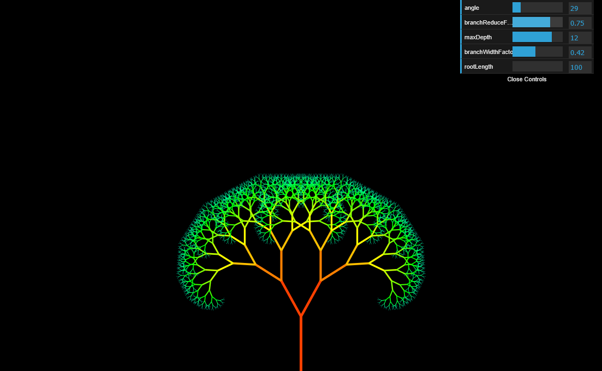

# 🌳 Fractal Tree

Explore the beauty of mathematical art with this interactive **Fractal Tree** simulation! Render mesmerizing fractal patterns directly in your browser.

👉 [Try it now!](https://sjnprjl.github.io/fractal-tree/)

---

## ✨ Features
- 🌲 **Interactive fractal tree generation**
- 🎨 **Customizable parameters** (angle, depth, color, etc.)
- ⚡ **Smooth and fast rendering** in the browser
- 🎭 **Randomized variations** for endless unique trees
- 🖥️ **No installation required** – just open and play!

## 🛠️ How It Works
This visualization is powered by recursive algorithms that draw branching patterns similar to trees in nature. Adjust parameters dynamically and watch the tree evolve!

## 📷 Screenshots


## 🚀 Play Now
Click below to start generating fractal trees instantly:
👉 [Launch Fractal Tree](https://sjnprjl.github.io/fractal-tree/)

## 🔧 Development & Contribution
Want to modify or enhance the fractal tree generator? Clone the repo and start experimenting!
```bash
git clone https://github.com/sjnprjl/fractal-tree.git
```

## 📜 License
MIT License – Free to use, modify, and share!

## 🌟 Support & Feedback
If you love this project, give it a ⭐ on GitHub!